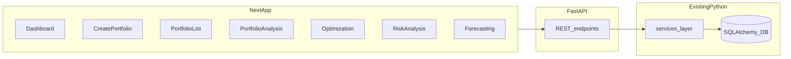

# План: Next.js фронт, API и Docker (без потери функционала Streamlit)

## Исходная карта UI (эталон)

Навигация в [streamlit_app/app.py](e:/Dev/Python/Done/WMC_Portfolio_Management/streamlit_app/app.py): **Dashboard**, **Create Portfolio**, **Portfolio List**, **Portfolio Analysis**, **Portfolio Optimization**, **Risk Analysis**, **Forecasting**. Дополнительно сайдбар: проверка API (DataService), блок About — переносится в общий layout (футер / статус).

## Шаг 0 — Стабильность бэкенда и каркас (до первой страницы Next)

**Цель:** зелёные проверки и минимальный API, на который смогут опираться все страницы.

- Исправить расхождения тестов и реализации ([tests/unit/test_price_manager.py](e:/Dev/Python/Done/WMC_Portfolio_Management/tests/unit/test_price_manager.py), [tests/unit/test_ticker_validator.py](e:/Dev/Python/Done/WMC_Portfolio_Management/tests/unit/test_ticker_validator.py)) с логикой в [core/data_manager/price_manager.py](e:/Dev/Python/Done/WMC_Portfolio_Management/core/data_manager/price_manager.py) и [core/data_manager/ticker_validator.py](e:/Dev/Python/Done/WMC_Portfolio_Management/core/data_manager/ticker_validator.py).
- Привести `pytest` к проходимости: сейчас `--cov-fail-under=80` в [pytest.ini](e:/Dev/Python/Done/WMC_Portfolio_Management/pytest.ini) даёт падение при ~20% покрытии по всему `core`+`services` — скорректировать политику (например, отдельный профиль CI без глобального fail-under или сужение `omit`/порога), чтобы локальная проверка была осмысленной.
- Добавить пакет API (предлагаемое расположение: `api/` или `backend/`): **FastAPI**, `CORSMiddleware`, `GET /health`, общие Pydantic-схемы ответов, ошибки в стиле HTTP (4xx/5xx) с текстом как у Streamlit (`ValidationError`, `ConflictError` из [core/exceptions.py](e:/Dev/Python/Done/WMC_Portfolio_Management/core/exceptions.py)).
- Зафиксировать зависимости API в [requirements.txt](e:/Dev/Python/Done/WMC_Portfolio_Management/requirements.txt) (или `requirements-api.txt` + установка в Docker).

**Критерий готовности шага 0:** `pytest` проходит по согласованным правилам; поднимается процесс API с `/health`.

---

## Шаг 1 — Dashboard (эквивалент [streamlit_app/pages/dashboard.py](e:/Dev/Python/Done/WMC_Portfolio_Management/streamlit_app/pages/dashboard.py))

**Streamlit-состав (не пропускать):**

- Quick Navigation → шесть ссылок на разделы (как кнопки `switch_page`).
- Блок **Market Indices**: карточки S&P 500, NASDAQ, Dow, Russell 2000 — логика [streamlit_app/utils/market_data.py](e:/Dev/Python/Done/WMC_Portfolio_Management/streamlit_app/utils/market_data.py), UI-компоненты [market_index_card.py](e:/Dev/Python/Done/WMC_Portfolio_Management/streamlit_app/components/market_index_card.py), [market_stats.py](e:/Dev/Python/Done/WMC_Portfolio_Management/streamlit_app/components/market_stats.py).
- График сравнения индексов — [market_indices_chart.py](e:/Dev/Python/Done/WMC_Portfolio_Management/streamlit_app/components/market_indices_chart.py).

**API:** эндпоинты, оборачивающие `DataService` / те же функции, что дергает дашборд (индексы + серии для графика).

**Next.js:** маршрут `/` или `/dashboard`; общий shell (см. шаг 0/стиль): фон/starfield и навигация по образцу [e:/Dev/WebSites/WildMarket_web](e:/Dev/WebSites/WildMarket_web) (`tailwind.config.ts`, CSS-переменные, при необходимости упрощённый перенос [header](e:/Dev/WebSites/WildMarket_web/app/components/layout/header.tsx) / [starfield](e:/Dev/WebSites/WildMarket_web/app/components/effects/starfield.tsx)).

**Критерий:** визуально и по данным совпадает с текущим дашбордом (карточки + график + навигация).

---

## Шаг 2 — Create Portfolio (эквивалент [streamlit_app/pages/create_portfolio.py](e:/Dev/Python/Done/WMC_Portfolio_Management/streamlit_app/pages/create_portfolio.py))

**Streamlit-состав (все 5 шагов + help):**

- Expander «How to Create a Portfolio» с тем же текстом/форматами.
- Шаги 1–5: `render_step_1` … `render_step_5` — имя, валюта, капитал; метод ввода (**Text**, **CSV/Excel**, **Manual**, **Template**); ввод активов; настройки и обзор (включая режим Buy-and-Hold / With Transactions и начальную транзакцию где применимо); финальное создание через `PortfolioService` + [CreatePortfolioRequest](e:/Dev/Python/Done/WMC_Portfolio_Management/services/schemas.py).
- Парсинг текста — [streamlit_app/utils/text_parser.py](e:/Dev/Python/Done/WMC_Portfolio_Management/streamlit_app/utils/text_parser.py); валидации — [streamlit_app/utils/validators.py](e:/Dev/Python/Done/WMC_Portfolio_Management/streamlit_app/utils/validators.py).

**API:** `POST /portfolios` (и при необходимости `POST /portfolios/validate` или валидация в том же запросе), опционально `POST /parse-ticker-weights` если логика должна совпадать 1:1 с парсером.

**Next.js:** многошаговый мастер (wizard) с прогрессом «Step X of 5», состояние на клиенте + отправка на API на финальном шаге.

**Критерий:** все четыре метода ввода и сценарии создания из Streamlit воспроизводимы.

---

## Шаг 3 — Portfolio List (эквивалент [streamlit_app/pages/portfolio_list.py](e:/Dev/Python/Done/WMC_Portfolio_Management/streamlit_app/pages/portfolio_list.py))

**Streamlit-состав:**

- Список: кэш 5 мин, поиск/фильтр, таблица, выбор строк, **bulk** операции, индивидуальные действия, **undo** удалённых.
- Режимы: `list` / `edit` / `view`.
- **Editor:** вкладки Positions | Transactions | Strategies (Strategies — плейсхолдер как в Streamlit).
- **View:** вкладки Overview | Positions | Transactions | Strategies; Overview с метриками и графиками [charts.py](e:/Dev/Python/Done/WMC_Portfolio_Management/streamlit_app/components/charts.py) (allocation); режим «With Transactions» / «Buy-and-Hold».
- **Transactions:** [transaction_form.py](e:/Dev/Python/Done/WMC_Portfolio_Management/streamlit_app/components/transaction_form.py), [transaction_table.py](e:/Dev/Python/Done/WMC_Portfolio_Management/streamlit_app/components/transaction_table.py), `TransactionService`.

**API:** CRUD портфелей, позиций, транзакций (зеркало вызовов `PortfolioService`, `TransactionService`, схемы [UpdatePortfolioRequest](e:/Dev/Python/Done/WMC_Portfolio_Management/services/schemas.py), `AddPositionRequest`, и т.д.).

**Next.js:** `/portfolios`, детальная страница `/portfolios/[id]` с теми же вкладками и действиями.

**Критерий:** ни одна операция из списка/редактора/просмотра/транзакций не отсутствует (кроме явно disabled «Export All» — либо перенести как disabled, либо реализовать, если появится бэкенд).

---

## Шаг 4 — Portfolio Analysis (эквивалент [streamlit_app/pages/portfolio_analysis.py](e:/Dev/Python/DDone/WMC_Portfolio_Management/streamlit_app/pages/portfolio_analysis.py))

Один «экран» в меню, но внутри **5 главных вкладок** — реализовать **подшагами 4a–4e**, каждый подшаг = полный перенос соответствующей функции Streamlit (включая подвкладки и блоки `st.subheader` внутри).

| Подшаг | Вкладка Streamlit     | Содержание (ориентир)                                                                                                                       |
| ------ | --------------------- | ------------------------------------------------------------------------------------------------------------------------------------------- |
| 4a     | Overview              | `_render_overview_tab`: ключевые метрики, производительность, дневные доходности, структура, сравнение с бенчмарком, метаданные             |
| 4b     | Performance           | `_render_performance_tab` + sub-tabs: returns / periodic / distribution                                                                     |
| 4c     | Risk                  | `_render_risk_tab` + sub-tabs: ключевые метрики, просадки, VaR, rolling, и т.д.                                                             |
| 4d     | Assets & Correlations | `_render_assets_tab` + sub-tabs: overview, correlations, per-asset детали (включая selectbox по тикеру)                                     |
| 4e     | Export & Reports      | `_render_export_tab` (PDF и пр.) через [services/report_service.py](e:/Dev/Python/Done/WMC_Portfolio_Management/services/report_service.py) |

**Параметры сверху (как в Streamlit):** даты, портфель, сравнение None / Index ETF (SPY, QQQ, …) / другой портфель, risk-free %, кнопки Calculate / Update Prices (если заглушка — явно такая же).

**API:** один или несколько эндпоинтов, вызывающих `AnalyticsService.calculate_portfolio_metrics` с теми же аргументами; для тяжёлых графиков — отдавать серии JSON + метаданные, рендер **Recharts** (или Plotly в браузере, если нужна 1:1 интерактивность).

**Критерий подшага:** чеклист по `st.subheader`/`st.tabs` внутри соответствующей функции `_render_`* закрыт.

---

## Шаг 5 — Portfolio Optimization (эквивалент [streamlit_app/pages/portfolio_optimization.py](e:/Dev/Python/Done/WMC_Portfolio_Management/streamlit_app/pages/portfolio_optimization.py))

**Streamlit-состав:** выбор портфеля, expander «Current Portfolio Information», даты, out-of-sample (окна 30/50/60%), выбор метода оптимизации, цели, ограничения весов, бенчмарк, запуск `OptimizationService`, отображение результатов (`_display_optimization_results`), efficient frontier, чувствительность, интерпретации — всё, что ведёт к `render_optimization_page` и вложенным блокам.

**API:** эндпоинт(ы) `POST /optimization/run` + при необходимости `GET` справочников методов/целей (из существующих хелперов в том же файле).

**Критерий:** все опции и ветки UI из Streamlit доступны в Next.

---

## Шаг 6 — Risk Analysis (эквивалент [streamlit_app/pages/risk_analysis.py](e:/Dev/Python/Done/WMC_Portfolio_Management/streamlit_app/pages/risk_analysis.py))

**Пять вкладок — пять подшагов 6a–6e:**

1. VaR Analysis — `_render_var_analysis`
2. Monte Carlo — `_render_monte_carlo`
3. Historical Scenarios — `_render_historical_scenarios`
4. Custom Scenario — `_render_custom_scenario`
5. Scenario Chain — `_render_scenario_chain`

Общие параметры: выбор портфеля, период (где применимо), `RiskService`.

**Критерий:** каждая вкладка перенесена полностью (включая подпанели и графики).

---

## Шаг 7 — Forecasting (эквивалент [streamlit_app/pages/forecasting.py](e:/Dev/Python/Done/WMC_Portfolio_Management/streamlit_app/pages/forecasting.py))

**Streamlit-состав:**

- Тип: Single Asset / Portfolio; выбор тикера из объединения портфелей или портфеля.
- Параметры: даты обучения, out-of-sample (как в оптимизации/прогнозе), горизонт (пресеты + custom days).
- Вкладки методов: Classical, Machine Learning, Deep Learning, Simple, Ensemble — все чекбоксы/параметры методов.
- Запуск и блок результатов `_display_forecast_results` с вложенными `results_tabs` (см. ~1842 в том же файле).

**API:** `POST /forecasting/run` (тяжёлый запрос; при необходимости async/job id позже).

**Критерий:** все категории методов и экран результатов, как в Streamlit.

---

## Шаг 8 — Docker и «открыть по клику»

- **Dockerfile** для Python API (установка зависимостей, `uvicorn`, переменные `DATABASE_URL`, `CACHE_DIR`, volume для `data/`).
- **Dockerfile** для Next (multi-stage: `npm ci`, `build`, `node` production).
- **docker-compose.yml:** сервисы `api` и `web`; `NEXT_PUBLIC_API_URL` указывает на `api`; общий volume для SQLite или подготовка к Postgres через env (без обязательной смены БД на первом этапе).
- Краткая инструкция в [README.md](e:/Dev/Python/Done/WMC_Portfolio_Management/README.md): `docker compose up`, порты, первый запуск миграций (`alembic` при необходимости).

**Опционально:** оставить цель `streamlit` в compose для параллельного сравнения с Next до полного выравнивания.

---

## Принципы переноса (чтобы ничего не упустить)

1. Перед каждым подшагом — пройти соответствующий файл Streamlit сверху вниз и составить мини-чеклист виджетов и вызовов сервисов.
2. Логику не дублировать в TypeScript: вся бизнес-логика остаётся в Python (`services/`*, `core/`*); Next только UI и запросы.
3. Стиль: токены и паттерны из Wild Market Web; шрифты/тема согласованы с [tailwind.config.ts](e:/Dev/WebSites/WildMarket_web/tailwind.config.ts) и [app/globals.css](e:/Dev/WebSites/WildMarket_web/app/globals.css).
4. Streamlit после завершения всех шагов: либо удалить из основного compose, либо оставить в `docs` как legacy — по вашему решению на шаге 8.

